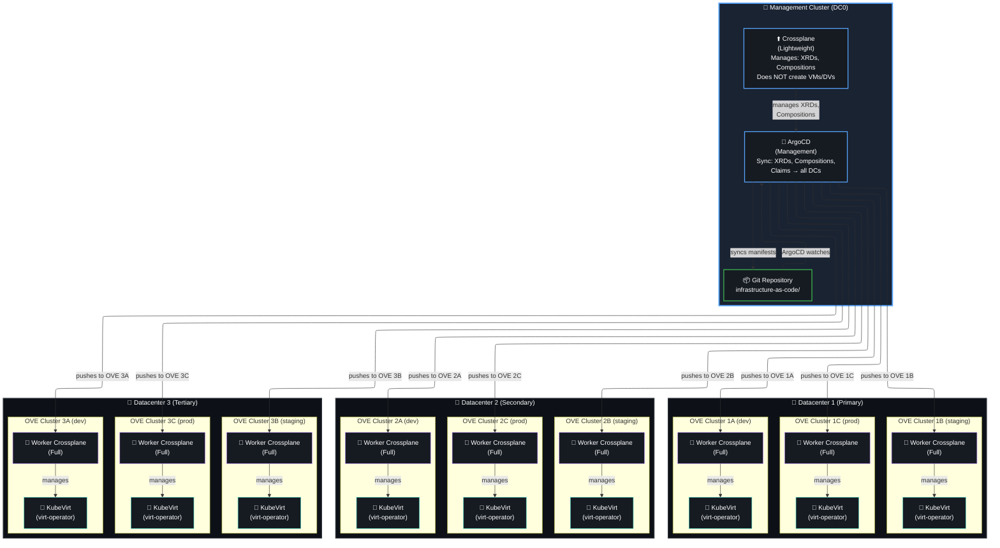
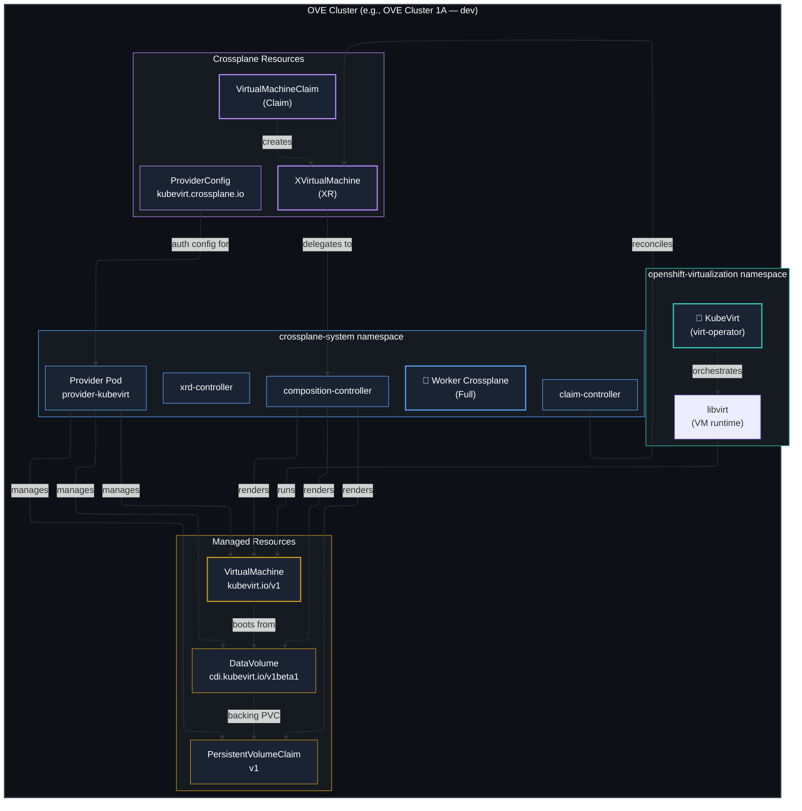
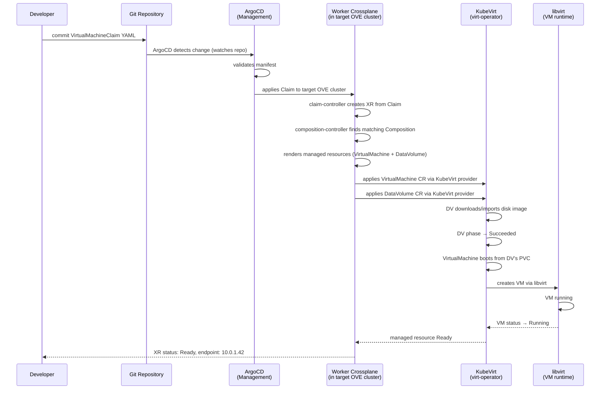
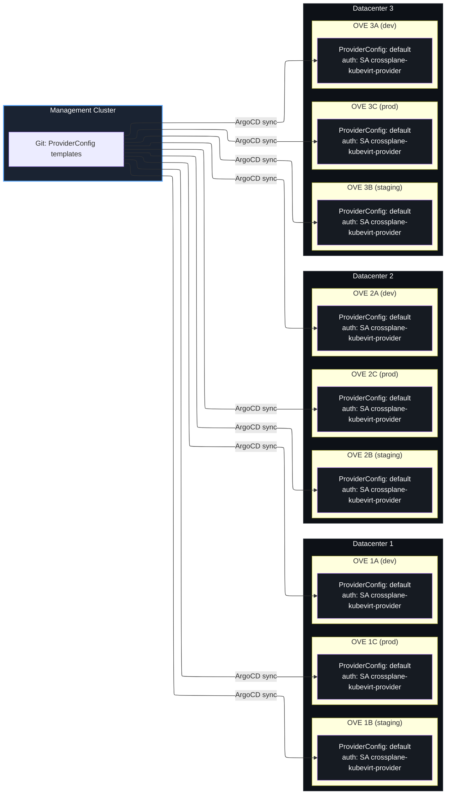

# Multi-Datacenter Topology — 3 DCs × 3 OVE Clusters

Crossplane + ArgoCD + OpenShift Virtualization topology for a three-datacenter deployment. Each datacenter runs three OVE clusters (dev, staging, prod).

## Architecture Summary

| Role | Component | Quantity | Purpose |
|----|--------|-------|------|
| **Management** | Crossplane (lightweight) | 1 | XRD/Composition distribution, policy enforcement |
| **Management** | ArgoCD | 1 | GitOps sync of manifests to all OVE clusters |
| **Worker** | Crossplane (full) | 9 | VM/DataVolume provisioning within each OVE cluster |

## Overall Architecture

## Single-DC Detail — One OVE Cluster

This diagram shows the internal components of a single OVE cluster, how the worker Crossplane connects to KubeVirt, and the VM provisioning flow.

## Data Flow — Claim to Running VM

## ProviderConfig Scoping Across Clusters

## Key Design Decisions

| Decision | Choice | Rationale |
|-------|------|--------|
| Management Crossplane scope | XRD/Composition only | Does not create VMs; delegates to workers |
| Worker Crossplane scope | Full (creates VMs, DVs, PVCs) | Each OVE cluster manages its own resources |
| ProviderConfig auth | In-cluster ServiceAccount | No remote kubeconfigs needed; OpenShift RBAC handles authorization |
| ArgoCD self-heal | `false` on workload namespaces | Prevents ArgoCD/Crossplane sync conflicts |
| Sync waves | RBAC → Providers → XRDs → Compositions → Claims | Ordered bootstrap per cluster |
| Cross-DC VM replication | Not managed by Crossplane | Out of scope; handled by application-level replication |

## Resource Inventory

| Resource | Count | Location |
|-------|-----|-------|
| Management Crossplane | 1 | Management Cluster (DC0) |
| Management ArgoCD | 1 | Management Cluster (DC0) |
| Worker Crossplane | 9 | One per OVE cluster (3 DCs × 3 clusters) |
| OVE clusters | 9 | 3 per datacenter (dev, staging, prod) |
| KubeVirt (virt-operator) | 9 | One per OVE cluster |
| ProviderConfigs | 9 | One per OVE cluster (in-cluster auth) |
| Git repositories | 1 | Central `infrastructure-as-code/` repo |
